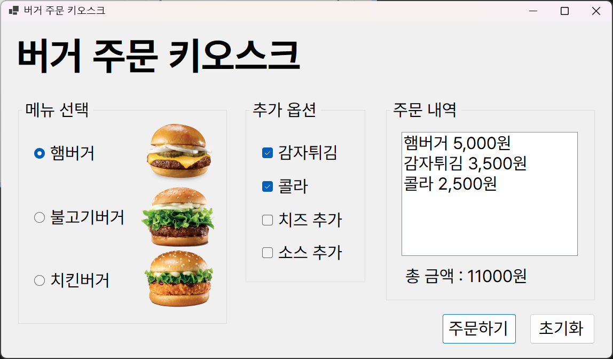
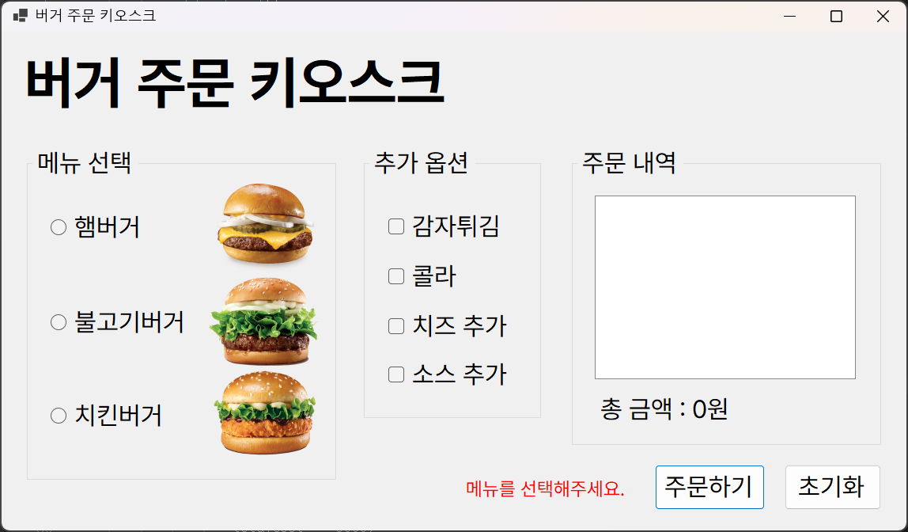

# 6주차 과제: 버거 키오스크

## 개요
- C# 프로그래밍 학습
- 1줄 소개: 라디오 버튼으로 햄버거를 선택하고 체크박스로 추가 옵션을 골라 주문하는 간단한 키오스크 UI
- 사용한 플랫폼:
    - C#, .NET Windows Forms, Visual Studio, Github
- 사용한 컨트롤:
    - RadioButton, CheckBox, Button, ListBox, Label
- 사용한 기술과 구현한 기능
    - 라디오 버튼을 통해 햄버거 한 가지를 선택하여 기본 금액을 설정
    - 체크박스로 감자튀김/콜라/치즈/소스를 선택하면 해당 금액을 합산
    - 주문 버튼 클릭 시 선택한 항목들을 ListBox에 추가하고 총 금액을 계산하여 표시
    - 햄버거 미선택 시 주문 불가 및 오류 메시지 표시
    - 초기화 버튼으로 선택/목록/금액 초기화
    - 금액은 천 단위 콤마 포맷(`{value:N0}`)으로 표시

## 실행 화면 (과제1)
- 과제1 코드의 실행 스크린샷

- 과제 내용
    - UI 구성
        - RadioButton과 CheckBox 등을 적절히 배치합니다.
        - GroupBox로 적절하게 그룹으로 묶습니다.
    - 주문하기 버튼과 초기화 버튼의 기능 구현
        - 주문 내역과 총 금액을 표시합니다.
        - 다시 주문할 수 있도록 초기화 합니다.

- 구현 내용과 기능 설명
    - 햄버거(햄버거 5,000원 / 불고기버거 4,000원 / 치킨버거 3,000원) 중 하나를 선택하면 해당 금액이 더해짐
    - 감자튀김 3,500원, 콜라 2,500원, 치즈 1,500원, 소스 500원은 체크박스로 추가 가능
    - 주문 버튼 클릭 시 선택 항목들이 ListBox에 추가되고 총 금액이 표시됨

## 실행 화면 (과제2)
- 과제2 코드의 실행 스크린샷

- 과제 내용
    - 아무 것도 선택하지 않고 주문하기 버튼을 누르면 에러 메시지 표시

- 구현 내용과 기능 설명
    - radioButton에 선택된게 없으면 lblError에 에러 메시지를 출력함

## 배운 내용
- Windows Forms 이벤트 처리 및 컨트롤 조작
- 코드의 재사용성을 위해 계산 로직을 중앙 메서드로 분리하는 방법
- 숫자 포맷팅으로 사용자 친화적인 금액 표시 (`{value:N0}`)